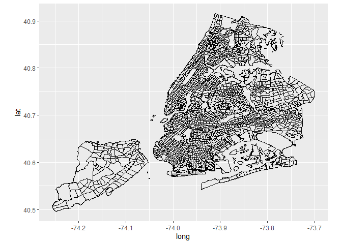
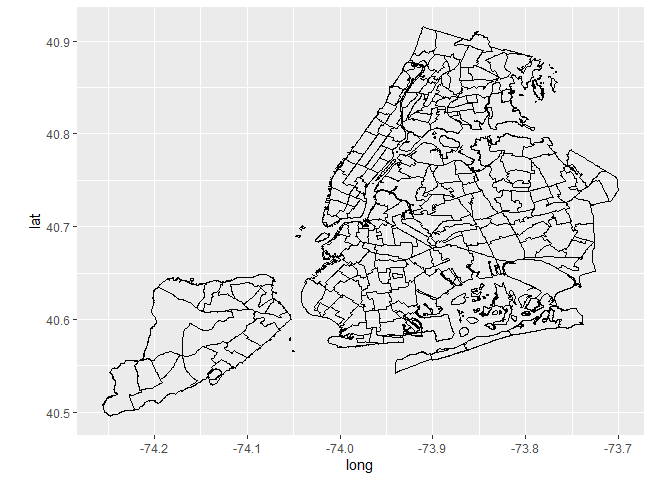

Mapping
================
Gloria Hu (gh2518)
11/21/2019

Map import

``` r
# Census tracts- taken from https://data.cityofnewyork.us/City-Government/2010-Census-Tracts/fxpq-c8ku
census_tracts = rgdal::readOGR(dsn = "./maps", layer = "2010-census-tracts")
```

    ## OGR data source with driver: ESRI Shapefile 
    ## Source: "C:\Users\glory\Documents\MPH Year 2\Fall 2019\Data Science\EvictionsFinalProject\maps", layer: "2010-census-tracts"
    ## with 2165 features
    ## It has 11 fields

``` r
ggplot() + 
  geom_polygon(data = census_tracts, aes(x = long, y = lat, group = group), colour = "black", fill = NA) +
  coord_equal()
```

    ## Regions defined for each Polygons

<!-- -->

``` r
# Neighborhoods- taken from https://data.cityofnewyork.us/City-Government/Neighborhood-Tabulation-Areas/cpf4-rkhq

nta = rgdal::readOGR(dsn = "./maps", layer = "2010-NTAs")
```

    ## OGR data source with driver: ESRI Shapefile 
    ## Source: "C:\Users\glory\Documents\MPH Year 2\Fall 2019\Data Science\EvictionsFinalProject\maps", layer: "2010-NTAs"
    ## with 195 features
    ## It has 7 fields

``` r
ggplot() + 
  geom_polygon(data = nta, aes(x = long, y = lat, group = group), colour = "black", fill = NA) +
  coord_equal()
```

    ## Regions defined for each Polygons

<!-- -->
