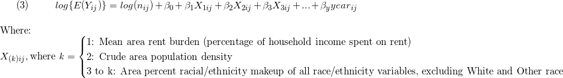

Try ZIP model???

```{r setup, include=FALSE}
options(scipen = 999)
knitr::opts_chunk$set(echo = TRUE)

library(tidyverse)
library(readxl)
library(plotly)
library(geepack)
library(modelr)
source('gee_stepper_o.R') ## custom stepwise function
```

```{r}
joined_data_bklyn_nomissing = 
  readRDS('./data/joined_data_bklyn_nomissing')

## integrating neighborhood as predictor
neighborhood_df = 
  read_excel("./data/NYC_neighborhoods_by_censustract_2010.xlsx", 
             skip = 5, 
             col_names = c("borough", "county_code", "boro_code", "census_tract", "PUMA", "nta_code", "neighborhood")
             ) %>% 
#creating 11 digit FIPS code by pasting country code (36) with `county_code` and `census_tract`
  mutate(geo_id = paste0("36", county_code, census_tract)
  ) %>% 
  rename(geoid = geo_id)

joined_data_bklyn_nomissing =
  left_join(joined_data_bklyn_nomissing,
          neighborhood_df) %>% 
  select(colnames(joined_data_bklyn_nomissing), neighborhood) %>% 
  mutate(neighborhood = as.factor(neighborhood),
         years_since_2010 = as.factor(years_since_2010))
```


### Count-based outcome (Poisson)

Since our outcome, eviction rate, is calculated using a **count** variable (number of evictions) repeated over time within areas, we'll model it using GEE with a Poisson link function.

```{r, echo = FALSE, message = FALSE}
#####
## poisson distribution of counts (and rates)
joined_data_bklyn_nomissing %>% 
  ggplot(aes(x = eviction_rate)) + 
  geom_histogram(binwidth = 0.1) +
  theme_light() +
  labs(x = "Eviction count per 100 renter-occupied households",
       y = "Count",
       title = "Distribution of eviction counts, standardized by area") +
  theme(plot.title = element_text(hjust = 0.5))
```

&nbsp;
&nbsp;

**Model:**

<!-- LaTeX code - edit on https://www.codecogs.com/latex/eqneditor.php, then download gif -->

<!-- $$ -->
<!-- (1) \hspace{20mm} log\{E({Y_{ij})}\} = log(n_{ij}) + \beta_0 + \beta_1*X_{ij} + \beta_2*year_{ij} \\ -->
<!-- \hspace{20mm}\\ -->
<!-- \hspace{20mm} \text{Where: }\\ -->
<!-- \hspace{20mm} _{ij}\hspace{2mm} \text{denotes Census Tract \textit{i} and year \textit{j}} \\ -->
<!-- \vspace{.01mm} \\ -->
<!-- \hspace{20mm}E({Y_{ij})} = \text{expected count of evictions} \\ -->
<!-- \hspace{20mm} n_{ij} = \text{offset term (number of renter-occupied housing units)} \\ -->
<!-- \hspace{20mm}X_{ij} = \begin{cases}\text{Area percent of population that speaks English less than "Very Well"} -->
<!-- \\ \text{Mean area rent burden (percentage of household income spent on rent)} -->
<!-- \\ \text{Area percent of population that is nonwhite} -->
<!-- \\ \text{Crude area population density (total population divided by area (mi} ^2) -->
<!-- \end{cases}\\ -->
<!-- $$ -->

&nbsp; 
&nbsp;


&nbsp;
&nbsp;


#### Univariable Poisson GEE models

```{r, message = FALSE}
#####
## trying glm with Poisson
univariate_poi = function(x){
  
  gee_poi = geeglm(evictions ~ 
                   #(eviction_filings - evictions) ~ ## testing discrepancy in rate as outcome - subtracted counts, kept offset
                   offset(log(renter_occupied_households)) + x + years_since_2010, ## here i removed the int term
                   data = joined_data_bklyn_nomissing, 
                   id = geoid, 
                   family = poisson, 
                   corstr = "ar1") %>% ## ar(1) corstr due to autocorrelation in data across time
  broom::tidy(conf.int = FALSE,
              conf.level = 0.95,
              exponentiate = FALSE,
              quick = FALSE)
  tibble(
    b0_est = gee_poi[[1,2]],
    b0_p = gee_poi[[1,5]],
    b1_est = gee_poi[[2,2]],
    RR = exp(gee_poi[[2,2]]),
    RR_10 = exp(gee_poi[[2,2]]*10),
    b1_p = gee_poi[[2,5]],
    year_b2_est = gee_poi[[3,2]],
    year_RR = exp(gee_poi[[3,2]]),
    year_p = gee_poi[[3,5]],
    # interaction_est = gee_poi[[4,2]], ## removed the int term
    # interaction_p = gee_poi[[4,5]]
  )
  
}

pred_poi_list = list("pct_eng" = pull(joined_data_bklyn_nomissing, pct_eng), 
                     "rent_burden" = pull(joined_data_bklyn_nomissing, rent_burden), 
                     "pct_nonwhite" = pull(joined_data_bklyn_nomissing, pct_nonwhite_racedata), 
                     "pop_density" = pull(joined_data_bklyn_nomissing, total_pop_densitydata)
                     )

gee_poi_output = map(pred_poi_list, univariate_poi) %>%
  do.call(rbind, .) %>%
  knitr::kable(digits = 2,
               caption = "Univarable GEE parameter estimates: predicted change in rate of evictions (standardized by area-specific number of renter-occupied households)")

gee_poi_output
```

However, we see that when controlling for percent African Americans comprising a community, the association between `pct_eng` and `evictions` flips. Above, we see that as `pct_eng` - the percentage of individuals who speak English less than 'Very Well'- goes up, eviction rates decrease, on average.

African Americans are a predominantly English-speaking community in the US but are nonetheless more vulnerable to evictions than White individuals. In this way, the relationship between `pct_eng` and `evictions` was actually being confounded by the percentage of African Americans in a community: a group with high rates of English fluency, and a predominant population in many areas of Brooklyn, was still experiencing higher rates of eviction.

Thus, after controlling for `pct_af_am`, we see the following estimates for `pct_eng` predicting `evictions`:

```{r, echo = FALSE}
#####
## side note - controlling for pct_af_am in pct_eng analyses
gee_poi_pct_eng = 
  geeglm(evictions ~ 
                   offset(log(renter_occupied_households)) + pct_eng + pct_af_am + years_since_2010, ## here i removed the int term
                   data = joined_data_bklyn_nomissing, 
                   id = geoid, 
                   family = poisson, 
                   corstr = "ar1") %>% ## ar(1) corstr due to autocorrelation in data across time
  broom::tidy(conf.int = FALSE,
              conf.level = 0.95,
              exponentiate = FALSE,
              quick = FALSE)

pct_eng_output =   
tibble(
    b0_est = gee_poi_pct_eng[[1,2]],
    b0_p = gee_poi_pct_eng[[1,5]],
    b1_est = gee_poi_pct_eng[[2,2]],
    RR = exp(gee_poi_pct_eng[[2,2]]),
    RR_10 = exp(gee_poi_pct_eng[[2,2]]*10),
    b1_p = gee_poi_pct_eng[[2,5]],
    year_b2_est = gee_poi_pct_eng[[3,2]],
    year_RR = exp(gee_poi_pct_eng[[3,2]]),
    year_p = gee_poi_pct_eng[[3,5]],
    # interaction_est = gee_poi_pct_eng[[4,2]], ## removed the int term
    # interaction_p = gee_poi_pct_eng[[4,5]]
  )

pct_eng_output %>% 
  knitr::kable(digits = 2)
```

As we can see, the association has been flipped, and the relationship between English non-fluency and eviction is positive, controlling for percentage of African Americans.

__Example Interpretations of Parameter Estimate__

  * For the exponentiated beta estimate (`b1_est`) for `pct_nonwhite`: For every 1 percent increase in nonwhite residents, the population-average eviction rate is expected to increase by 2.2 percent, on average, controlling for year (RR = 1.022, 95% CI [to be calculated by modifying code]). Given a 10 percent increase in nonwhite residents, we would expect the population-average eviction rate to increase by 22 percent, on average, controlling for year (represented by `RR_10`).

#### Multivariable Poisson GEE model

Since the effect of population density on eviction count wasn't statistically significant, controlling for year, we won't include it in our multivariable model. Thus, our multivariable model will take the form:

&nbsp;
&nbsp;

<!-- $$ -->
<!-- (2) \hspace{1mm} log\{E({Y_{ij})}\} = log(n_{ij}) + \beta_0 + \beta_1X_{1ij} + \beta_2X_{2ij} + \beta_3X_{3ij} + \beta_4X_{4ij} + ... + \beta_yyear_{ij} \\ -->
<!-- \hspace{20mm}\\ -->
<!-- \hspace{20mm} \text{Where: }\\ -->
<!-- \hspace{20mm}X_{(k)ij}, \text{where \textit{k}} = \begin{cases}\text{1: Area percent of population that speaks English less than `Very Well'} -->
<!-- \\ \text{2: Mean area rent burden (percentage of household income spent on rent)} -->
<!-- \\ \text{3: Crude area population density} -->
<!-- \\ \text{4 to k: Area percent racial/ethnicity makeup of all race/ethnicity variables} -->
<!-- \end{cases}\\ -->
<!-- $$ -->


__Next Steps__

  * Correlation analysis of predictors (prevent multicollinearity)
  * Raw plots of predictor vs. outcome? Log outcome? How to visualize?
  * Model building process ideas:
    + Fit vs. Residual plots, with investigation of outliers
    + Compare models to saturated models (i.e. all main effects and interaction terms)
    + Cross-validation of models
  * Shiny app that builds model based on any variable we have (output = # evictions per 100 renter households per year)

***

## Correlation Plot

```{r}
joined_data_bklyn_nomissing %>% 
  #select(-pct_nonwhite_racedata, -pct_af_am, am_ind_ak_native = aian) %>% 
  select(pct_eng, rent_burden, density, 
           white, black, asian, aian, nhpi, other, hisp) %>% 
  select_if(is.numeric) %>% 
  cor() %>% 
  corrplot::corrplot(type = "lower",
                     method = "square", 
                     addCoef.col = "black", 
                     diag = FALSE, 
                     number.cex = .7,
                     tl.col = "black",
                     tl.cex = .9)

## NOTES
  ## include hisp instead of other, since highly correlated (.85)
  ## include black not white, since highly correlated (-.87)
  ## fit two models:
      ## one to look at pct_eng, controlling for race (pct_eng + all races except white, other + other predictors)
      ## one to just look at race (all races except white, other + other predictors)
```


## Hypothesized Model

```{r}
## need to include `black` since confounds pct_eng -> evictions relationship
  ## but `black` also collinear with `pct_nonwhite`, which we want as a predictor
  ## solution: include all races EXCEPT WHITE AND OTHER in one analysis (interpret races)
  ## then include races + pct_eng (ESL controlling for races)

hyp_model_eng = 
  geeglm(evictions ~
           offset(log(renter_occupied_households)) +
           years_since_2010 +
           pct_eng + rent_burden + density + 
           white + black + asian + aian + nhpi + other + hisp +
           pct_eng*black,
         data = joined_data_bklyn_nomissing,
         id = geoid,
         family = poisson,
         corstr = "ar1")

hyp_model_eng %>% 
  broom::tidy() %>% 
  knitr::kable()

hyp_model_race = 
  geeglm(evictions ~
           offset(log(renter_occupied_households)) +
           years_since_2010 +
           rent_burden + density + 
           black + asian + aian + nhpi + hisp,
         data = joined_data_bklyn_nomissing,
         id = geoid,
         family = poisson,
         corstr = "ar1")

hyp_model_race %>% 
  broom::tidy() %>% 
  knitr::kable()

```

## Model Fitting using `gee_stepper`

```{r}
## use full dataset
full_fit =
  geeglm(evictions ~ 
           offset(log(renter_occupied_households)) + years_since_2010 +
           pct_eng + rent_burden + pct_nonwhite_racedata + density + ## hypothesized
           black + aian + asian + nhpi + other + hisp + ## race
           poverty_rate + pct_renter_occupied + median_gross_rent + median_household_income + median_property_value +
           eviction_filings + family_size + pct_fam_households,
         data = joined_data_bklyn_nomissing,
         id = geoid,
         family = poisson,
         corstr = "ar1")

# gee_stepper_o(full_fit, formula(full_fit)) ## customized function to automatically include offset and time covariate

```

Covariates selected by stepwise selection (using QIC):  
  * [`offset`] - held constant
  * `black`
  * `hisp` 
  * `rent_burden`
  * `pct_eng`
  * `density`
  * `median_gross_rent`
  * `poverty_rate` 
  * `median_household_income`
  * `asian` 
  * `aian` 
  * `nhpi` 

Final formula:
```{r}
step_model = 
  geeglm(formula = evictions ~ years_since_2010 + hisp + rent_burden + 
         density + pct_eng + median_household_income + nhpi + poverty_rate + 
         median_gross_rent + pct_renter_occupied + aian + other + 
         pct_nonwhite_racedata + asian + offset(log(renter_occupied_households)), 
         family = poisson, 
         data = joined_data_bklyn_nomissing, 
         id = geoid, 
         corstr = "ar1")


```

Predicted vs. residual for each model

```{r}
tidy = function(model) {
  
  model %>% 
    broom::tidy() %>% 
    knitr::kable()
  
}

tidy(hyp_model_eng)
tidy(hyp_model_race)
tidy(step_model)

## eng model
eng_residual_fit =
  joined_data_bklyn_nomissing %>% 
  select(evictions, eviction_rate, all.vars(as.list(formula(hyp_model_eng))[[3]])) %>% ## selecting all variables in formula
  add_predictions(., hyp_model_eng, type = 'response') %>% 
  add_residuals(., hyp_model_eng) %>% 
  mutate(resid_calc = evictions - pred)

## fit-residual plot
eng_residual_fit %>% 
  ggplot(aes(x = pred, y = resid)) +
  geom_point() + 
  theme_bw()

## histogram of residuals
eng_residual_fit %>% 
  ggplot(aes(x = resid)) +
  geom_histogram()


#####

## race_model
race_residual_fit =
  joined_data_bklyn_nomissing %>% 
  select(evictions, eviction_rate, all.vars(as.list(formula(hyp_model_race))[[3]])) %>% ## selecting all variables in formula
  add_predictions(., hyp_model_race, type = "response") %>% 
  add_residuals(., hyp_model_race) %>% 
  mutate(pred_rate = (pred / renter_occupied_households) * 100,
     resid_rate = eviction_rate - pred_rate)


## fit plot
race_residual_fit %>% 
  ggplot(aes(x = pred_rate, y = resid_rate)) +
  geom_point() + 
  theme_bw()

## histo
race_residual_fit %>% 
  ggplot(aes(x = resid)) +
  geom_histogram()


#####

## step_model
step_residual_fit =
  joined_data_bklyn_nomissing %>% 
  select(evictions, eviction_rate, all.vars(as.list(formula(step_model))[[3]])) %>% ## selecting all variables in formula
  add_predictions(., step_model, type = "response") %>% 
  add_residuals(., step_model) %>% 
  mutate(pred_rate = (pred / renter_occupied_households) * 100,
     resid_rate = eviction_rate - pred_rate)


## fit plot
step_residual_fit %>% 
  ggplot(aes(x = pred, y = resid)) +
  geom_point() + 
  theme_bw()
```

GLMs

```{r}
empty_glm =
  glm(formula = evictions ~ offset(log(renter_occupied_households)),
      data = joined_data_bklyn_nomissing,
      family = poisson)

naive_glm =
  glm(formula = evictions ~ offset(log(renter_occupied_households)) + years_since_2010,
      data = joined_data_bklyn_nomissing,
      family = poisson)

glm_eng =   
  glm(formula = evictions ~ offset(log(renter_occupied_households)) + years_since_2010 + 
                pct_eng + rent_burden + density + white + black + asian + 
                aian + nhpi + other + hisp + neighborhood + pct_eng * black,
    data = joined_data_bklyn_nomissing,
    family = 'poisson')

#####
glm_residual_fit = 
  joined_data_bklyn_nomissing %>% 
    select(evictions, eviction_rate, all.vars(as.list(formula(glm_eng))[[3]])) %>% ## selecting all variables in formula
    add_predictions(., glm_eng, type = "response") %>% 
    add_residuals(., glm_eng) %>% 
    mutate(resid_calc = evictions - pred)

glm_residual_fit %>% 
  ggplot(aes(x = pred, y = resid_calc)) +
  geom_point() + 
  theme_bw()

boot::glm.diag.plots(glm_eng)
#####
glm_race =   
  glm(formula = evictions ~ offset(log(renter_occupied_households)) + years_since_2010 + 
    rent_burden + density + black + asian + aian + nhpi + hisp + neighborhood,
    data = joined_data_bklyn_nomissing,
    family = 'poisson')

full_fit_glm =
  glm(evictions ~ offset(log(renter_occupied_households)) + years_since_2010 + 
    pct_eng + rent_burden + pct_nonwhite_racedata + density + 
    black + aian + asian + nhpi + other + hisp + poverty_rate + 
    pct_renter_occupied + median_gross_rent + median_household_income + 
    median_property_value + neighborhood,
    data = joined_data_bklyn_nomissing,
    family = 'poisson')

base_fit_glm =
  glm(evictions ~ offset(log(renter_occupied_households)),
      data = joined_data_bklyn_nomissing,
      family = 'poisson')

## GLM stepwise selection
# MASS::stepAIC(base_fit_glm, 
#               scope = c(upper = formula(full_fit_glm), lower = formula(base_fit_glm)), 
#               direction = "forward")

glm_step = 
  glm(formula = evictions ~ neighborhood + years_since_2010 + black + 
    hisp + rent_burden + median_property_value + median_gross_rent + 
    density + poverty_rate + nhpi + pct_renter_occupied + aian + 
    offset(log(renter_occupied_households)), 
    family = 'poisson',
    data = joined_data_bklyn_nomissing)


```

GAM?

```{r}
#####
# library(mgcv)
# 
# ## eng
# gam_eng =
#   gam(formula(hyp_model_eng), 
#     data = joined_data_bklyn_nomissing,
#     family = ziP)
# 
# AIC(glm_eng, gam_eng)
# 
# gam_eng_fitted_vals = 
#   gam_eng[[3]]
# 
# joined_data_bklyn_nomissing %>% 
#   mutate(gam_eng_pred = gam_eng[[3]],
#          gam_eng_resid = gam_eng[[2]]) %>% 
#   ggplot(aes(x = gam_eng_pred, y = gam_eng_resid)) +
#   geom_point()
# 
# ## race
# gam_race =
#   gam(formula(hyp_model_race), 
#     data = joined_data_bklyn_nomissing,
#     family = ziP)
# 
# ## 
```

Comparing RMSEs

```{r}
## eng models
# rmse(gam_eng, joined_data_bklyn_nomissing)
rmse(glm_eng, joined_data_bklyn_nomissing)
rmse(hyp_model_eng, joined_data_bklyn_nomissing)

## race models
rmse(hyp_model_race, joined_data_bklyn_nomissing)
# rmse(gam_race, joined_data_bklyn_nomissing)

## step model
rmse(step_model, joined_data_bklyn_nomissing)

## TEST MODELS
  ## hypothesized model fit with:
      # GEE (accounting for clustering)
  ## stepped model fit with:
      # GEE (accounting for clustering)

empty_model = ## no predictors
  geeglm(formula = evictions ~ offset(log(renter_occupied_households)),
       data = joined_data_bklyn_nomissing,
       family = poisson,
       id = geoid,
       corstr = "ar1")

naive_model = ## just year
  geeglm(formula = evictions ~ offset(log(renter_occupied_households)) + years_since_2010,
       data = joined_data_bklyn_nomissing,
       family = poisson,
       id = geoid,
       corstr = "ar1")  
  

rmse(empty_model, joined_data_bklyn_nomissing)
rmse(naive_model, joined_data_bklyn_nomissing)
rmse(full_fit, joined_data_bklyn_nomissing)

```

Cross-Validation

```{r}
set.seed(10)

## creating test-training pairs
model_data_cv =
  joined_data_bklyn_nomissing %>%
  crossv_mc(., 100)

## unpacking pairs
model_data_cv =
  model_data_cv %>%
  mutate(
    train = map(train, as_tibble),
    test = map(test, as_tibble))

## assessing prediction accuracy
model_data_cv =
  model_data_cv %>%
  mutate(empty_glm1 = map(train, ~glm(formula = formula(empty_glm),
                                 family = poisson,
                                 data = joined_data_bklyn_nomissing)),
         naive_glm1 = map(train, ~glm(formula = formula(naive_glm),
                                 family = poisson,
                                 data = joined_data_bklyn_nomissing)),
         empty = map(train, ~glm(formula = formula(empty_model),
                                 family = poisson,
                                 data = joined_data_bklyn_nomissing)),
         naive = map(train, ~glm(formula = formula(naive_model),
                                 family = poisson,
                                 data = joined_data_bklyn_nomissing)),
         glm_eng1 = map(train, ~glm(formula = formula(glm_eng),
                                      family = poisson,
                                      data = joined_data_bklyn_nomissing)),
         glm_race1 = map(train, ~glm(formula = formula(glm_race),
                                      family = poisson,
                                      data = joined_data_bklyn_nomissing)),
         glm_step1 = map(train, ~glm(formula = formula(glm_step),
                                      family = poisson,
                                      data = joined_data_bklyn_nomissing)),
         gee_eng = map(train, ~geeglm(formula = formula(hyp_model_eng),
                                      family = poisson,
                                      data = joined_data_bklyn_nomissing,
                                      id = geoid,
                                      corstr = "ar1")),
         gee_race = map(train, ~geeglm(formula = formula(hyp_model_race),
                                      family = poisson,
                                      data = joined_data_bklyn_nomissing,
                                      id = geoid,
                                      corstr = "ar1")),
         gee_step = map(train, ~geeglm(formula = formula(step_model),
                                      family = poisson,
                                      data = joined_data_bklyn_nomissing,
                                      id = geoid,
                                      corstr = "ar1")))

 model_data_cv =
   model_data_cv %>%
   mutate(#rmse_empty_glm = map2_dbl(empty_glm1, test, ~rmse(model = .x, data = .y)),
          #rmse_naive_glm = map2_dbl(naive_glm1, test, ~rmse(model = .x, data = .y)),
          rmse_empty_gee = map2_dbl(empty, test, ~rmse(model = .x, data = .y)),
          rmse_naive_gee = map2_dbl(naive, test, ~rmse(model = .x, data = .y)),
          #rmse_eng_glm = map2_dbl(glm_eng1, test, ~rmse(model = .x, data = .y)),
          #rmse_race_glm = map2_dbl(glm_race1, test, ~rmse(model = .x, data = .y)),
          #rmse_step_glm = map2_dbl(glm_step1, test, ~rmse(model = .x, data = .y)),
          rmse_eng_gee = map2_dbl(gee_eng, test, ~rmse(model = .x, data = .y)),
          rmse_race_gee = map2_dbl(gee_race, test, ~rmse(model = .x, data = .y)),
          rmse_step_gee = map2_dbl(gee_step, test, ~rmse(model = .x, data = .y)))

## plotting RMSEs
model_data_cv %>%
  select(starts_with("rmse"), -contains('glm')) %>%
  pivot_longer(
    everything(),
    names_to = "model",
    values_to = "rmse",
    names_prefix = "rmse_") %>%
  mutate(model = fct_reorder(model, rmse, .desc = TRUE)) %>%
  ggplot(aes(x = model, y = rmse)) + 
  geom_violin() +
  theme_light()

```


# Outline

## Overview

Using existing data, we aim to investigate factors that are associated with - and can potentially be used to predict - eviction rates among census tracts in Brooklyn. 

We propose using Generalized Estimating Equations (GEE). GEEs can be used to model correlated/hierarchical data, and group-level (hierarchical) estimates are not desired. Since our data are repeated over time within census tract (2010-2016), we expect there to be autocorrelation present across years, and we can address this using GEE modeling techniques. 

More specifically, we propose using a GEE modelling framework with a log link function. Our outcome variable, eviction rate, is calculated by dividing count of evictions by the number of renter-occupied households; since this is based on a **count** variable, evictions, we expect our outcome to assume a Poisson distribution. Thus, we can use a log link function to model the expected count of evictions, and include the denominator of our eviction rate - number of renter-occupied households - as an offset term in the right-hand side of our equation.

Finally, we propose using an AR(1) correlation structure, since autocorrelation can be reasonably expected given our data are measured over time. (In short, this means that, as one data point moves farther away from another correlated data point, the correlation between them decreases exponentially. We might reasonably expect this to happen over time with our data - e.g. a census tract's 2006 eviction rate may be more similar to its 2005 eviction rate than to its 2000 eviction rate.)

### Count-based outcome (Poisson)

Since our outcome, eviction rate, is calculated using a **count** variable (number of evictions) repeated over time within areas, we'll model it using GEE with a Poisson link function.

```{r, echo = FALSE, message = FALSE}
#####
## poisson distribution of counts (and rates)
joined_data_bklyn_nomissing %>% 
  ggplot(aes(x = eviction_rate)) + 
  geom_histogram(binwidth = 0.1) +
  theme_light() +
  labs(x = "Eviction count per 100 renter-occupied households",
       y = "Count",
       title = "Distribution of eviction counts, standardized by area") +
  theme(plot.title = element_text(hjust = 0.5))
```


## Relevant predictors

Although we formulated specific hypotheses regarding predictors of eviction in Brooklyn based on existing research, we wanted to include as many potential predictors as possible to test against our hypothesized predictors. The data we are using includes the following variables:

  * `evictions`. Number of evictions at census level.
  * `eviction_filings`. Number of eviction filings at census level.
  * `renter_occupied_households`. Number of renter occupied households in census tract. As mentioned above, this forms the denominator of our modelled rate and will be included in all models as an offset term (as `log(renter_occupied_households)`).
  * `years_since_2010`. Since our data range from 2010 to 2016, and we did not want to assume a constant effect of time, we included year as a set of indicator variables in all models except our empty model (see below).
  * `hisp`. Percent of population (at census tract level, for all race/ethnicity variables) that self-report Hispanic ethnicity.
  * `white`. Percent self-reporting White race.
  * `black`. Percent self-reporting Black race.
  * `asian`. Percent self-reporting Asian race.
  * `aian`. Percent self-reporting American Indian / Alaska Native race.
  * `nhpi`. Percent self-reporting Native Hawaiian / Pacific Islander race.
  * `other`. Percent self-reporting other race.
  * `rent_burden`. Average percent of income spent on rent.
  * `density`. Population density.
  * `pct_eng`. Percent of population who speak English less than 'Very Well'. This is interpreted as a proxy for percent English as a second language (ESL) speakers. 
  * `median_household_income`. Median census tract household income in USD.
  * `poverty_rate`. Percent living below Federal Poverty Line (FPL).
  * `median_gross_rent`. Median census tract gross rent in USD.
  * `pct_renter_occupied`. Percent of census tract occupied by renters.
  * `median_property_value`. Median census tract property value in USD.
  * `family_size`. Average family size in census tract.
  * `pct_fam_households`. Percentage of census tract households that contain families.

*Note:* Since our repeated data are clustered within census tracts, we could not include neighborhood, an otherwise important predictor of eviction rates. If we wanted to conduct models similar to these but (1) within census tracts across time AND (2) also modelling census tracts clustered within neighborhoods, we would have to move into some sort of hierarchical/multilevel modelling structure.

In our model-building Shiny app (see navigation bar), we have included a set of indicator variables representing Brooklyn neighborhoods using a simpler Generalized Linear Model (GLM).

## Hypothesis

Based on prior reading and research, we hypothesize the following predictors of eviction count at the census tract level. See above for variable definitions.

  * `years_since_2010`
  * `rent_burden`
  * `density`
  * `pct_eng`
  * Race/ethnicity variables (`white`, `black`, `asian`, `aian`, `nhpi`, `other`, `hisp`)

&nbsp;
&nbsp;

**Model:**

<!-- LaTeX code - edit on https://www.codecogs.com/latex/eqneditor.php, then download gif -->

<!-- $$ -->
<!-- (1) \hspace{20mm} log\{E({Y_{ij})}\} = log(n_{ij}) + \beta_0 + \beta_k*X_{kij} + \beta_y*year_{ij} \\ -->
<!-- \hspace{20mm}\\ -->
<!-- \hspace{20mm} \text{Where: }\\ -->
<!-- \hspace{20mm} _{ij}\hspace{2mm} \text{denotes Census Tract \textit{i} and year \textit{j}} \\ -->
<!-- \vspace{.01mm} \\ -->
<!-- \hspace{20mm}E({Y_{ij})} = \text{expected count of evictions} \\ -->
<!-- \hspace{20mm} n_{ij} = \text{offset term (number of renter-occupied housing units)} \\ -->
<!-- \hspace{20mm}X_{kij} = \begin{cases}\text{Area percent of population that speaks English less than `Very Well'} -->
<!-- \\ \text{Mean area rent burden (percentage of household income spent on rent)} -->
<!-- \\ \text{Area percent of [specific race/ethnicity]} -->
<!-- \\ \text{Crude area population density (total population divided by area (mi} ^2) -->
<!-- \end{cases}\\ -->
<!-- $$ -->

&nbsp; 
&nbsp;


&nbsp;
&nbsp;

## Correlation matrix

Before proceeding, it is important to assess crude correlation among our relevant variables, in case issues of multicollinearity arise during model development.

```{r corr_matrix}
test = 
joined_data_bklyn_nomissing %>% 
  mutate(year = as.numeric(year)) %>% 
  #select(-pct_nonwhite_racedata, -pct_af_am, am_ind_ak_native = aian) %>% 
  select(year, eviction_rate, 
         pct_eng, rent_burden, density, 
         white, black, asian, aian, nhpi, other, hisp,
         median_household_income, poverty_rate, median_gross_rent, median_property_value, pct_renter_occupied,
         family_size, pct_fam_households) %>% 
#  select_if(is.numeric) %>% 
  cor() %>% 
  corrplot::corrplot(type = "lower",
                     method = "square", 
                     addCoef.col = "black", 
                     diag = FALSE, 
                     number.cex = .7,
                     tl.col = "black",
                     tl.cex = .9)

## NOTES
  ## include hisp instead of other, since highly correlated (.85)
  ## include black not white, since highly correlated (-.87)
  ## fit two models:
      ## one to look at pct_eng, controlling for race (pct_eng + all races except white, other + other predictors)
      ## one to just look at race (all races except white, other + other predictors)
```

Of relevance to our hypotheses, the following variables were highly correlated and thus may not be accurately interpreted  in a model as independent predictors:

  * `pct_eng` and `year` (*r* = 0.76)
  * `white` and `black` (*r* = -0.87)
  * `hisp` and `other` race (*r* = 0.85)

### Discussion of confounding of `black` on `pct_eng` -> `evictions`

After performing exploratory data analysis and crude univariate plots (*not shown*), we found that the relationship between `pct_eng` - percent of ESL speakers - and eviction rate is confounded by `black` race. 

At first, the relationship between ESL speakers and eviction rate was inverse - as ESL increased, evictions actually decreased. This is counter to our hypotheses, as non-English speaking and immigrant communities have been shown to experience much higher rates of eviction. However, we knew that Black race had the potential to confound this relationship, as Black NYC communities are overwhelmingly English-speaking and also at an increased risk of eviction due to other factors. 

Once we adjusted for Black race in the relationship between ESL and evictions, the relationship flipped, and EsL was demonstrated to have a positive association with eviction rate, adjusting for Black race. 

### Refining and subdefining our hypothesized model

We refined our hypothesized models based on our exploratory confounding and other analyses:

  1. As noted above, ESL should not be included in a model without adjusting for Black race nor should it be interpreted independently of year due to high correlation. 
  
Thus, our first hypothesized sub-model will include ESL and percent of all race/ethnicity variables (interpreted as the independent effects of ESL and years since 2010 [highly correlated], rent burden, or population density on evictions, adjusting for each other predictor variable and race/ethnicity). [Equation 2]
  
<!-- $$ -->
<!-- (2) \hspace{1mm} log\{E({Y_{ij})}\} = log(n_{ij}) + \beta_0 + \beta_1X_{1ij} + \beta_2X_{2ij} + \beta_3X_{3ij} + \beta_4X_{4ij} + ... + \beta_yyear_{ij} \\ -->
<!-- \hspace{20mm}\\ -->
<!-- \hspace{20mm} \text{Where: }\\ -->
<!-- \hspace{20mm}X_{(k)ij}, \text{where \textit{k}} = \begin{cases}\text{1: Area percent of population that speaks English less than `Very Well'} -->
<!-- \\ \text{2: Mean area rent burden (percentage of household income spent on rent)} -->
<!-- \\ \text{3: Crude area population density} -->
<!-- \\ \text{4 to k: Area percent racial/ethnicity makeup of all race/ethnicity variables} -->
<!-- \end{cases}\\ -->
<!-- $$ -->
  
&nbsp; 
&nbsp;


&nbsp;
&nbsp;
  
  2. As also noted above, percent White race and percent Black race are highly correlated in our data (*r* = 0.87), and percent other race and percent Hispanic ethnicity are also highly correlated (*r* = 0.85). 
  
Thus, a second hypothesized sub-model will observe the independent effects of percent racial/ethnic compositions (**excluding** White and Other race), rent burden, population density, or years since 2010 on eviction rates, adjusting for other predictor variables. [Equation 3]
  
<!-- $$ -->
<!-- (3) \hspace{10mm} log\{E({Y_{ij})}\} = log(n_{ij}) + \beta_0 + \beta_1X_{1ij} + \beta_2X_{2ij} + \beta_3X_{3ij} + ... + \beta_yyear_{ij} \\ -->
<!-- \hspace{20mm}\\ -->
<!-- \hspace{20mm} \text{Where: }\\ -->
<!-- \hspace{20mm}X_{(k)ij}, \text{where \textit{k}} = \begin{cases}\text{1: Mean area rent burden (percentage of household income spent on rent)} -->
<!-- \\ \text{2: Crude area population density} -->
<!-- \\ \text{3 to k: Area percent racial/ethnicity makeup of all race/ethnicity variables, excluding White and Other race} -->
<!-- \end{cases}\\ -->
<!-- $$ -->

&nbsp; 
&nbsp;



&nbsp;
&nbsp;

## Stepwise automatic model selection

To contrast with our hypothesis-informed model building process, we wanted to test a stepwise model selection algorithm. We used the `gee_stepper` function within the `pstools` package, which performs a forward step selection process with a set of GEE predictors, using QIC to find a 'best fit' model.

We slightly modified the function code to create our own function - `gee_stepper_o` - in order to include our offset term by default in the stepwise selection process.


```{r}
## use full dataset
full_fit =
  geeglm(evictions ~ 
           offset(log(renter_occupied_households)) + years_since_2010 +
           pct_eng + rent_burden + pct_nonwhite_racedata + density + ## hypothesized
           black + aian + asian + nhpi + other + hisp + ## race
           poverty_rate + pct_renter_occupied + median_gross_rent + median_household_income + median_property_value +
           eviction_filings + family_size + pct_fam_households,
         data = joined_data_bklyn_nomissing,
         id = geoid,
         family = poisson,
         corstr = "ar1")

gee_stepper_o(full_fit, formula(full_fit)) ## customized function to automatically include offset and time covariate

```

As we can see, our GEE stepwise selection model includes predictors:

  * [`offset`] - held constant
  * `black`
  * `hisp` 
  * `rent_burden`
  * `pct_eng`
  * `density`
  * `median_gross_rent`
  * `poverty_rate` 
  * `median_household_income`
  * `asian` 
  * `aian` 
  * `nhpi` 
  
This model includes both `pct_eng` and `black`, so we can fully interpret the effects of ESL adjusting for confounding by percent Black race. However, to be conservative in our interpretations, `median_household_income` should not be interpreted separately from `poverty_rate` (*r* = -0.73) or `median_gross_rent` (*r* = -0.74).

### Summary of models

To summarize, we will consider the following models to predict census tract-level eviction rates:

  1. Two hypothesized models
    a. A hypothesized model based primarily on percent ESL speakers [Equation 2, above]
    b. A hypothesized model based primarily on independent effects of race/ethnicity percentages [Equation 3, above]
  2. A model selected via a GEE-specific forward stepwise selection process
  
In addition to these three models (1a, 1b, 2), we propose two baseline models:

  B1. An empty model, in which there are no predictors, and only the outcome and offset terms are included on opposite sides of the equation [e.g. `evictions ~ offset(log(renter_occupied_households))`]
  B2. A naive model, which only uses time to predict eviction rate (i.e. the above model, plus `years_since_2010` on the right-hand-side of the model)

## Cross-validation of each

Since our data are modelled using GEE and are not all nested within each other, there is not a straightforward way to compare their prediction capabilities such as hypothesis testing or AIC (in this case, QIC). However, we can use **cross validation**, which allows us to compare prediction accuracy across non-nested models. While this technique does not allow us to assess statistical significance of hypotheses/models/predictors tested, we still believe it will be useful in gauging model usefulness. 

Specifically, we will compare the repeat-sampled distribution of each model's **root mean squared error**, with lower values indicating lower error and better overall prediction.

(Technical notes: We resampled 100 training/testing splits [default 80% training, 20% testing] on our data using the function `crossv_mc`. We then ran our 5 models on each of our 100 resampled training datasets, then extracted the root mean squared error as a measure of how well our training models predicted our testing data. 100 RMSEs resulted for each model, the distributions of which were then grouped by model and comparatively plotted using `ggplot` and `geom_violin` [violin plots].)

```{r}
set.seed(10)

## creating test-training pairs
model_data_cv =
  joined_data_bklyn_nomissing %>%
  crossv_mc(., 100)

## unpacking pairs
model_data_cv =
  model_data_cv %>%
  mutate(
    train = map(train, as_tibble),
    test = map(test, as_tibble))

## assessing prediction accuracy
model_data_cv =
  model_data_cv %>%
  mutate(empty = map(train, ~geeglm(formula = formula(empty_model),
                                      family = poisson,
                                      data = joined_data_bklyn_nomissing,
                                      id = geoid,
                                      corstr = "ar1")),
         naive = map(train, ~geeglm(formula = formula(naive_model),
                                      family = poisson,
                                      data = joined_data_bklyn_nomissing,
                                      id = geoid,
                                      corstr = "ar1")),
         gee_eng = map(train, ~geeglm(formula = formula(hyp_model_eng),
                                      family = poisson,
                                      data = joined_data_bklyn_nomissing,
                                      id = geoid,
                                      corstr = "ar1")),
         gee_race = map(train, ~geeglm(formula = formula(hyp_model_race),
                                      family = poisson,
                                      data = joined_data_bklyn_nomissing,
                                      id = geoid,
                                      corstr = "ar1")),
         gee_step = map(train, ~geeglm(formula = formula(step_model),
                                      family = poisson,
                                      data = joined_data_bklyn_nomissing,
                                      id = geoid,
                                      corstr = "ar1")))

 model_data_cv =
   model_data_cv %>%
   mutate(#rmse_empty_glm = map2_dbl(empty_glm1, test, ~rmse(model = .x, data = .y)),
          #rmse_naive_glm = map2_dbl(naive_glm1, test, ~rmse(model = .x, data = .y)),
          rmse_empty_gee = map2_dbl(empty, test, ~rmse(model = .x, data = .y)),
          rmse_naive_gee = map2_dbl(naive, test, ~rmse(model = .x, data = .y)),
          #rmse_eng_glm = map2_dbl(glm_eng1, test, ~rmse(model = .x, data = .y)),
          #rmse_race_glm = map2_dbl(glm_race1, test, ~rmse(model = .x, data = .y)),
          #rmse_step_glm = map2_dbl(glm_step1, test, ~rmse(model = .x, data = .y)),
          rmse_eng_gee = map2_dbl(gee_eng, test, ~rmse(model = .x, data = .y)),
          rmse_race_gee = map2_dbl(gee_race, test, ~rmse(model = .x, data = .y)),
          rmse_step_gee = map2_dbl(gee_step, test, ~rmse(model = .x, data = .y)))

## plotting RMSEs
model_data_cv %>%
  select(starts_with("rmse"), -contains('glm')) %>%
  pivot_longer(
    everything(),
    names_to = "model",
    values_to = "rmse",
    names_prefix = "rmse_") %>%
  mutate(model = fct_reorder(model, rmse, .desc = TRUE)) %>%
  ggplot(aes(x = model, y = rmse, fill = model)) + 
  geom_violin() +
  theme_light() +
  scale_fill_brewer(type = 'seq', palette = 'Purples')

```

As we can see, our empty and naive models are clearly inferior in terms of their prediction abilities to our other hypothesized and selection-based models.

This is the only clear-cut difference, as the latter three models - our two hypothesized models, and our stepwise model - are very similar in terms of their prediction capabilities.

(*Note:* None of our models had particularly good predictive capabilities, and the differences between our models given their RMSE distributions is comparatively small. However, we will assume that the difference in RMSE is still meaningful.)

As this is the case, we will opt for model simplicity and select the simplest model with the most easily-interpretable results: the hypothesized model based primarily on the independent effects of non-White race/ethnicity percentages, rent burden, population density, and years since 2010 [Equation 3, described above and re-printed below].

&nbsp;
&nbsp;


&nbsp;
&nbsp;

## Conclusions

Our model can be estimated via GEE:

```{r}
hyp_model_race = 
  geeglm(evictions ~
           offset(log(renter_occupied_households)) +
           years_since_2010 +
           rent_burden + density + 
           black + asian + aian + nhpi + hisp,
         data = joined_data_bklyn_nomissing,
         id = geoid,
         family = poisson,
         corstr = "ar1")

hyp_model_race %>% 
  broom::tidy() %>% 
  knitr::kable()
```

Here, we can see that all hypothesized predictors are significantly associated with eviction rate in Brooklyn except for American Indian / Alaska Native race (p = 0.25) at the 5% level of significance.

Since we used a Poisson (log) link function, we should exponentiate our parameter estimates to get an interpretable estimated measure of effect, interpreted as an estimated **risk ratio**.

For example, to interpret our parameter estimate for `black`, we would exponentiate our parameter estimate, 0.01887 (e^0.01887 = 1.0190). This is equal to our estimated risk ratio. We can thus say that the population-average eviction rate (or risk of eviction) is expected to be 1.0190 times higher for each one percentage-point increase in Brooklyn's Black population, adjusting for percentage of other non-White race/ethnicity (Asian, American Indian / Alaska Native, Native Hawaiian / Pacific Islander, and Hispanic), rent burden, population density, and years since 2010.

To make our risk estimates even more meaningful, we can interpret risk ratios for multiple units. For example, given the above, e^0.01887*10 = 1.2076; for each 10 percent increase in Brooklyn's Black population, we expect the eviction rate to increase by 1.21 times, adjusting for other factors listed in the previous paragraph.

## Prediction model (for Shiny app?)

```{r}
## this works really well
exp(predict(glm_step, newdata = data.frame(years_since_2010 = '4',
                                           neighborhood = 'Madison',
                                           black = 90,
                                           hisp = 40,
                                           rent_burden = 35,
                                           median_property_value = 100000,
                                           median_gross_rent = 1000,
                                           density = 50000,
                                           poverty_rate = 60,
                                           nhpi = 2,
                                           pct_renter_occupied = 70,
                                           aian = 2,
                                           renter_occupied_households = 100)))
```

