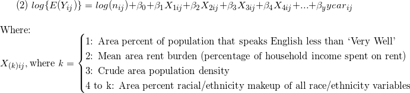

```{r setup, include=FALSE}
options(scipen = 999) # keeps R from using scientific notation with large GEOIDs
knitr::opts_chunk$set(echo = TRUE)
library(tidyverse)
library(readxl)
library(plotly)
library(geepack)

joined_data_bklyn_nomissing = 
  readRDS('./data/joined_data_bklyn_nomissing')
```

## Regressions (Question 3)

### Continuous outcome (Gaussian)
The generalized estimating equation for eviction rates (continuous) on each of our predictors of interest is as follows:

E(evictions_ij) = β0 + β1(year_ij) + β2(predictor_ij) + β3(year_ij*predictor_ij)

Regression function w/ output:
```{r}
univariate = function(x){
  
  gee_line = geeglm(eviction_rate ~ x + year + year*x, data = joined_data_bklyn_nomissing, id = geoid, family = gaussian, corstr = "unstructured") %>%
  broom::tidy(conf.int = FALSE, conf.level = 0.95,
  exponentiate = FALSE, quick = FALSE)
  
  tibble(
    b0_est = gee_line[[1,2]],
    b0_p = gee_line[[1,5]],
    b1_est = gee_line[[2,2]],
    b1_p = gee_line[[2,5]],
    year_est = gee_line[[3,2]],
    year_p = gee_line[[3,5]],
    interaction_est = gee_line[[4,2]],
    interaction_p = gee_line[[4,5]]
  )
  
}

pred_list = list("pct_eng" = pull(joined_data_bklyn_nomissing, pct_eng), 
              "rent_burden" = pull(joined_data_bklyn_nomissing, rent_burden), 
              "pct_nonwhite" = pull(joined_data_bklyn_nomissing, pct_nonwhite_racedata), 
              "pop_density" = pull(joined_data_bklyn_nomissing, total_pop_densitydata)
              )

gee_output = map(pred_list, univariate) %>%
  do.call(rbind, .) %>%
  knitr::kable(digits = 2)

gee_output
```

__Example interpretation:__

* For each 1% increase in people who speak English less than "very well" in a census tract, the eviction rate increases by 0.40, on average. However, this relationship is not significant at the 5% level, and does not appear to change over time.

* For each 1% increase in the non-White population, the eviction rate appears to decrease by 12.94, and this relationship is significant at the 5% level. However, this relationship appears to be attenuating over time.

### Count-based outcome (Poisson)

Since our outcome, eviction rate, is calculated using a **count** variable (number of evictions) repeated over time within areas, we'll model it using GEE with a Poisson link function.

```{r, echo = FALSE, message = FALSE}
## poisson distribution of counts (and rates)
joined_data_bklyn_nomissing %>% 
  ggplot(aes(x = eviction_rate)) + 
  geom_histogram(binwidth = 0.1) +
  theme_light() +
  labs(x = "Eviction count per 100 renter-occupied households",
       y = "Count",
       title = "Distribution of eviction counts, standardized by area") +
  theme(plot.title = element_text(hjust = 0.5))
```

&nbsp;
&nbsp;

**Model:**

<!-- LaTeX code - edit on https://www.codecogs.com/latex/eqneditor.php, then download gif -->

<!-- $$ -->
<!-- (1) \hspace{20mm} log\{E({Y_{ij})}\} = log(n_{ij}) + \beta_0 + \beta_1*X_{ij} + \beta_2*year_{ij} \\ -->
<!-- \hspace{20mm}\\ -->
<!-- \hspace{20mm} \text{Where: }\\ -->
<!-- \hspace{20mm} _{ij}\hspace{2mm} \text{denotes Census Tract \textit{i} and year \textit{j}} \\ -->
<!-- \vspace{.01mm} \\ -->
<!-- \hspace{20mm}E({Y_{ij})} = \text{expected count of evictions} \\ -->
<!-- \hspace{20mm} n_{ij} = \text{offset term (number of renter-occupied housing units)} \\ -->
<!-- \hspace{20mm}X_{ij} = \begin{cases}\text{Area percent of population that speaks English less than "Very Well"} -->
<!-- \\ \text{Mean area rent burden (percentage of household income spent on rent)} -->
<!-- \\ \text{Area percent of population that is nonwhite} -->
<!-- \\ \text{Crude area population density (total population divided by area (mi} ^2) -->
<!-- \end{cases}\\ -->
<!-- $$ -->

&nbsp; 
&nbsp;


&nbsp;
&nbsp;


#### Univariable Poisson GEE models

```{r, message = FALSE}
## trying glm with Poisson
univariate_poi = function(x){
  
  gee_poi = geeglm(evictions ~ 
                   #(eviction_filings - evictions) ~ ## testing discrepancy in rate as outcome - subtracted counts, kept offset
                   offset(log(renter_occupied_households)) + x + years_since_2010, ## here i removed the int term
                   data = joined_data_bklyn_nomissing, 
                   id = geoid, 
                   family = poisson, 
                   corstr = "ar1") %>% ## ar(1) corstr due to autocorrelation in data across time
  broom::tidy(conf.int = FALSE,
              conf.level = 0.95,
              exponentiate = FALSE,
              quick = FALSE)
  tibble(
    b0_est = gee_poi[[1,2]],
    b0_p = gee_poi[[1,5]],
    b1_est = gee_poi[[2,2]],
    RR = exp(gee_poi[[2,2]]),
    RR_10 = exp(gee_poi[[2,2]]*10),
    b1_p = gee_poi[[2,5]],
    year_b2_est = gee_poi[[3,2]],
    year_RR = exp(gee_poi[[3,2]]),
    year_p = gee_poi[[3,5]],
    # interaction_est = gee_poi[[4,2]], ## removed the int term
    # interaction_p = gee_poi[[4,5]]
  )
  
}

pred_poi_list = list("pct_eng" = pull(joined_data_bklyn_nomissing, pct_eng), 
                     "rent_burden" = pull(joined_data_bklyn_nomissing, rent_burden), 
                     "pct_nonwhite" = pull(joined_data_bklyn_nomissing, pct_nonwhite_racedata), 
                     "pop_density" = pull(joined_data_bklyn_nomissing, total_pop_densitydata)
                     )

gee_poi_output = map(pred_list, univariate_poi) %>%
  do.call(rbind, .) %>%
  knitr::kable(digits = 2,
               caption = "Univarable GEE parameter estimates: predicted change in rate of evictions (standardized by area-specific number of renter-occupied households)")

gee_poi_output
```

However, we see that when controlling for percent African Americans comprising a community, the association between `pct_eng` and `evictions` flips. Above, we see that as `pct_eng` - the percentage of individuals who speak English less than 'Very Well'- goes up, eviction rates decrease, on average.

African Americans are a predominantly English-speaking community in the US but are nonetheless more vulnerable to evictions than White individuals. In this way, the relationship between `pct_eng` and `evictions` was actually being confounded by the percentage of African Americans in a community: a group with high rates of English fluency, and a predominant population in many areas of Brooklyn, was still experiencing higher rates of eviction.

Thus, after controlling for `pct_af_am`, we see the following estimates for `pct_eng` predicting `evictions`:

```{r, echo = FALSE}
## side note - controlling for pct_af_am in pct_eng analyses
gee_poi_pct_eng = 
  geeglm(evictions ~ 
                   offset(log(renter_occupied_households)) + pct_eng + pct_af_am + years_since_2010, ## here i removed the int term
                   data = joined_data_bklyn_nomissing, 
                   id = geoid, 
                   family = poisson, 
                   corstr = "ar1") %>% ## ar(1) corstr due to autocorrelation in data across time
  broom::tidy(conf.int = FALSE,
              conf.level = 0.95,
              exponentiate = FALSE,
              quick = FALSE)

pct_eng_output =   
tibble(
    b0_est = gee_poi_pct_eng[[1,2]],
    b0_p = gee_poi_pct_eng[[1,5]],
    b1_est = gee_poi_pct_eng[[2,2]],
    RR = exp(gee_poi_pct_eng[[2,2]]),
    RR_10 = exp(gee_poi_pct_eng[[2,2]]*10),
    b1_p = gee_poi_pct_eng[[2,5]],
    year_b2_est = gee_poi_pct_eng[[3,2]],
    year_RR = exp(gee_poi_pct_eng[[3,2]]),
    year_p = gee_poi_pct_eng[[3,5]],
    # interaction_est = gee_poi_pct_eng[[4,2]], ## removed the int term
    # interaction_p = gee_poi_pct_eng[[4,5]]
  )

pct_eng_output %>% 
  knitr::kable(digits = 2)
```

As we can see, the association has been flipped, and the relationship between English non-fluency and eviction is positive, controlling for percentage of African Americans.

__Example Interpretations of Parameter Estimate__

  * For the exponentiated beta estimate (`b1_est`) for `pct_nonwhite`: For every 1 percent increase in nonwhite residents, the population-average eviction rate is expected to increase by 2.2 percent, on average, controlling for year (RR = 1.022, 95% CI [to be calculated by modifying code]). Given a 10 percent increase in nonwhite residents, we would expect the population-average eviction rate to increase by 22 percent, on average, controlling for year (represented by `RR_10`).

#### Multivariable Poisson GEE model

Since the effect of population density on eviction count wasn't statistically significant, controlling for year, we won't include it in our multivariable model. Thus, our multivariable model will take the form:

&nbsp;
&nbsp;

<!-- $$ -->
<!-- (2) \hspace{1mm} log\{E({Y_{ij})}\} = log(n_{ij}) + \beta_0 + \beta_1*X_{1ij} + \beta_2*X_{2ij} + \beta_3*X_{3ij} + \beta_4*year_{ij} \\ -->
<!-- \hspace{20mm}\\ -->
<!-- \hspace{20mm} \text{Where: }\\ -->
<!-- \hspace{20mm}X_{(k)ij}, \text{where \textit{k} = \begin{cases}\text{1: Area percent of population that speaks English less than "Very Well"} -->
<!-- \\ \text{2: Mean area rent burden (percentage of household income spent on rent)} -->
<!-- \\ \text{3: Area percent of population that is nonwhite} -->
<!-- \end{cases}\\ -->
<!-- $$ -->



__Next Steps__

  * Correlation analysis of predictors (prevent multicollinearity)
  * Raw plots of predictor vs. outcome? Log outcome? How to visualize?
  * Model building process ideas:
    + Fit vs. Residual plots, with investigation of outliers
    + Compare models to saturated models (i.e. all main effects and interaction terms)
    + Cross-validation of models
  * Shiny app that builds model based on any variable we have (output = # evictions per 100 renter households per year)
