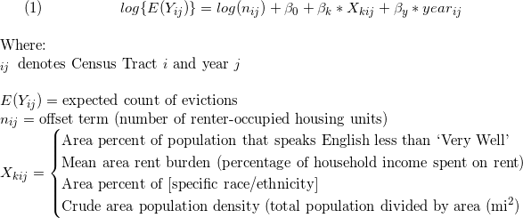

Try ZIP model???

```{r setup, include=FALSE}
options(scipen = 999)
knitr::opts_chunk$set(echo = TRUE)

library(tidyverse)
library(readxl)
library(plotly)
library(geepack)
library(modelr)
source('gee_stepper_o.R') ## custom stepwise function
```

```{r}
joined_data_bklyn_nomissing = 
  readRDS('./data/joined_data_bklyn_nomissing')

## integrating neighborhood as predictor
neighborhood_df = 
  read_excel("./data/NYC_neighborhoods_by_censustract_2010.xlsx", 
             skip = 5, 
             col_names = c("borough", "county_code", "boro_code", "census_tract", "PUMA", "nta_code", "neighborhood")
             ) %>% 
#creating 11 digit FIPS code by pasting country code (36) with `county_code` and `census_tract`
  mutate(geo_id = paste0("36", county_code, census_tract)
  ) %>% 
  rename(geoid = geo_id)

joined_data_bklyn_nomissing =
  left_join(joined_data_bklyn_nomissing,
          neighborhood_df) %>% 
  select(colnames(joined_data_bklyn_nomissing), neighborhood) %>% 
  mutate(neighborhood = as.factor(neighborhood),
         years_since_2010 = as.factor(years_since_2010))
```


### Count-based outcome (Poisson)

Since our outcome, eviction rate, is calculated using a **count** variable (number of evictions) repeated over time within areas, we'll model it using GEE with a Poisson link function.

```{r, echo = FALSE, message = FALSE}
#####
## poisson distribution of counts (and rates)
joined_data_bklyn_nomissing %>% 
  ggplot(aes(x = eviction_rate)) + 
  geom_histogram(binwidth = 0.1) +
  theme_light() +
  labs(x = "Eviction count per 100 renter-occupied households",
       y = "Count",
       title = "Distribution of eviction counts, standardized by area") +
  theme(plot.title = element_text(hjust = 0.5))
```

&nbsp;
&nbsp;

**Model:**

<!-- LaTeX code - edit on https://www.codecogs.com/latex/eqneditor.php, then download gif -->

<!-- $$ -->
<!-- (1) \hspace{20mm} log\{E({Y_{ij})}\} = log(n_{ij}) + \beta_0 + \beta_1*X_{ij} + \beta_2*year_{ij} \\ -->
<!-- \hspace{20mm}\\ -->
<!-- \hspace{20mm} \text{Where: }\\ -->
<!-- \hspace{20mm} _{ij}\hspace{2mm} \text{denotes Census Tract \textit{i} and year \textit{j}} \\ -->
<!-- \vspace{.01mm} \\ -->
<!-- \hspace{20mm}E({Y_{ij})} = \text{expected count of evictions} \\ -->
<!-- \hspace{20mm} n_{ij} = \text{offset term (number of renter-occupied housing units)} \\ -->
<!-- \hspace{20mm}X_{ij} = \begin{cases}\text{Area percent of population that speaks English less than "Very Well"} -->
<!-- \\ \text{Mean area rent burden (percentage of household income spent on rent)} -->
<!-- \\ \text{Area percent of population that is nonwhite} -->
<!-- \\ \text{Crude area population density (total population divided by area (mi} ^2) -->
<!-- \end{cases}\\ -->
<!-- $$ -->

&nbsp; 
&nbsp;



&nbsp;
&nbsp;


#### Univariable Poisson GEE models

```{r, message = FALSE}
#####
## trying glm with Poisson
univariate_poi = function(x){
  
  gee_poi = geeglm(evictions ~ 
                   #(eviction_filings - evictions) ~ ## testing discrepancy in rate as outcome - subtracted counts, kept offset
                   offset(log(renter_occupied_households)) + x + years_since_2010, ## here i removed the int term
                   data = joined_data_bklyn_nomissing, 
                   id = geoid, 
                   family = poisson, 
                   corstr = "ar1") %>% ## ar(1) corstr due to autocorrelation in data across time
  broom::tidy(conf.int = FALSE,
              conf.level = 0.95,
              exponentiate = FALSE,
              quick = FALSE)
  tibble(
    b0_est = gee_poi[[1,2]],
    b0_p = gee_poi[[1,5]],
    b1_est = gee_poi[[2,2]],
    RR = exp(gee_poi[[2,2]]),
    RR_10 = exp(gee_poi[[2,2]]*10),
    b1_p = gee_poi[[2,5]],
    year_b2_est = gee_poi[[3,2]],
    year_RR = exp(gee_poi[[3,2]]),
    year_p = gee_poi[[3,5]],
    # interaction_est = gee_poi[[4,2]], ## removed the int term
    # interaction_p = gee_poi[[4,5]]
  )
  
}

pred_poi_list = list("pct_eng" = pull(joined_data_bklyn_nomissing, pct_eng), 
                     "rent_burden" = pull(joined_data_bklyn_nomissing, rent_burden), 
                     "pct_nonwhite" = pull(joined_data_bklyn_nomissing, pct_nonwhite_racedata), 
                     "pop_density" = pull(joined_data_bklyn_nomissing, total_pop_densitydata)
                     )

gee_poi_output = map(pred_poi_list, univariate_poi) %>%
  do.call(rbind, .) %>%
  knitr::kable(digits = 2,
               caption = "Univarable GEE parameter estimates: predicted change in rate of evictions (standardized by area-specific number of renter-occupied households)")

gee_poi_output
```

However, we see that when controlling for percent African Americans comprising a community, the association between `pct_eng` and `evictions` flips. Above, we see that as `pct_eng` - the percentage of individuals who speak English less than 'Very Well'- goes up, eviction rates decrease, on average.

African Americans are a predominantly English-speaking community in the US but are nonetheless more vulnerable to evictions than White individuals. In this way, the relationship between `pct_eng` and `evictions` was actually being confounded by the percentage of African Americans in a community: a group with high rates of English fluency, and a predominant population in many areas of Brooklyn, was still experiencing higher rates of eviction.

Thus, after controlling for `pct_af_am`, we see the following estimates for `pct_eng` predicting `evictions`:

```{r, echo = FALSE}
#####
## side note - controlling for pct_af_am in pct_eng analyses
gee_poi_pct_eng = 
  geeglm(evictions ~ 
                   offset(log(renter_occupied_households)) + pct_eng + pct_af_am + years_since_2010, ## here i removed the int term
                   data = joined_data_bklyn_nomissing, 
                   id = geoid, 
                   family = poisson, 
                   corstr = "ar1") %>% ## ar(1) corstr due to autocorrelation in data across time
  broom::tidy(conf.int = FALSE,
              conf.level = 0.95,
              exponentiate = FALSE,
              quick = FALSE)

pct_eng_output =   
tibble(
    b0_est = gee_poi_pct_eng[[1,2]],
    b0_p = gee_poi_pct_eng[[1,5]],
    b1_est = gee_poi_pct_eng[[2,2]],
    RR = exp(gee_poi_pct_eng[[2,2]]),
    RR_10 = exp(gee_poi_pct_eng[[2,2]]*10),
    b1_p = gee_poi_pct_eng[[2,5]],
    year_b2_est = gee_poi_pct_eng[[3,2]],
    year_RR = exp(gee_poi_pct_eng[[3,2]]),
    year_p = gee_poi_pct_eng[[3,5]],
    # interaction_est = gee_poi_pct_eng[[4,2]], ## removed the int term
    # interaction_p = gee_poi_pct_eng[[4,5]]
  )

pct_eng_output %>% 
  knitr::kable(digits = 2)
```

As we can see, the association has been flipped, and the relationship between English non-fluency and eviction is positive, controlling for percentage of African Americans.

__Example Interpretations of Parameter Estimate__

  * For the exponentiated beta estimate (`b1_est`) for `pct_nonwhite`: For every 1 percent increase in nonwhite residents, the population-average eviction rate is expected to increase by 2.2 percent, on average, controlling for year (RR = 1.022, 95% CI [to be calculated by modifying code]). Given a 10 percent increase in nonwhite residents, we would expect the population-average eviction rate to increase by 22 percent, on average, controlling for year (represented by `RR_10`).

#### Multivariable Poisson GEE model

Since the effect of population density on eviction count wasn't statistically significant, controlling for year, we won't include it in our multivariable model. Thus, our multivariable model will take the form:

&nbsp;
&nbsp;

<!-- $$ -->
<!-- (2) \hspace{1mm} log\{E({Y_{ij})}\} = log(n_{ij}) + \beta_0 + \beta_1*X_{1ij} + \beta_2*X_{2ij} + \beta_3*X_{3ij} + \beta_4*year_{ij} \\ -->
<!-- \hspace{20mm}\\ -->
<!-- \hspace{20mm} \text{Where: }\\ -->
<!-- \hspace{20mm}X_{(k)ij}, \text{where \textit{k} = \begin{cases}\text{1: Area percent of population that speaks English less than "Very Well"} -->
<!-- \\ \text{2: Mean area rent burden (percentage of household income spent on rent)} -->
<!-- \\ \text{3: Area percent of population that is nonwhite} -->
<!-- \end{cases}\\ -->
<!-- $$ -->


__Next Steps__

  * Correlation analysis of predictors (prevent multicollinearity)
  * Raw plots of predictor vs. outcome? Log outcome? How to visualize?
  * Model building process ideas:
    + Fit vs. Residual plots, with investigation of outliers
    + Compare models to saturated models (i.e. all main effects and interaction terms)
    + Cross-validation of models
  * Shiny app that builds model based on any variable we have (output = # evictions per 100 renter households per year)

***

## Correlation Plot

```{r}
joined_data_bklyn_nomissing %>% 
  #select(-pct_nonwhite_racedata, -pct_af_am, am_ind_ak_native = aian) %>% 
  select(pct_eng, rent_burden, density, 
           white, black, asian, aian, nhpi, other, hisp) %>% 
  select_if(is.numeric) %>% 
  cor() %>% 
  corrplot::corrplot(type = "lower",
                     method = "square", 
                     addCoef.col = "black", 
                     diag = FALSE, 
                     number.cex = .7,
                     tl.col = "black",
                     tl.cex = .9)

## NOTES
  ## include hisp instead of other, since highly correlated (.85)
  ## include black not white, since highly correlated (-.87)
  ## fit two models:
      ## one to look at pct_eng, controlling for race (pct_eng + all races except white, other + other predictors)
      ## one to just look at race (all races except white, other + other predictors)
```


## Hypothesized Model

```{r}
## need to include `black` since confounds pct_eng -> evictions relationship
  ## but `black` also collinear with `pct_nonwhite`, which we want as a predictor
  ## solution: include all races EXCEPT WHITE AND OTHER in one analysis (interpret races)
  ## then include races + pct_eng (ESL controlling for races)

hyp_model_eng = 
  geeglm(evictions ~
           offset(log(renter_occupied_households)) +
           years_since_2010 +
           pct_eng + rent_burden + density + 
           white + black + asian + aian + nhpi + other + hisp +
           pct_eng*black,
         data = joined_data_bklyn_nomissing,
         id = geoid,
         family = poisson,
         corstr = "ar1")

hyp_model_eng %>% 
  broom::tidy() %>% 
  knitr::kable()

hyp_model_race = 
  geeglm(evictions ~
           offset(log(renter_occupied_households)) +
           years_since_2010 +
           rent_burden + density + 
           black + asian + aian + nhpi + hisp,
         data = joined_data_bklyn_nomissing,
         id = geoid,
         family = poisson,
         corstr = "ar1")

hyp_model_race %>% 
  broom::tidy() %>% 
  knitr::kable()

```

## Model Fitting using `gee_stepper`

```{r}
## use full dataset
full_fit =
  geeglm(evictions ~ 
           offset(log(renter_occupied_households)) + years_since_2010 +
           pct_eng + rent_burden + pct_nonwhite_racedata + density + ## hypothesized
           black + aian + asian + nhpi + other + hisp + ## race
           poverty_rate + pct_renter_occupied + median_gross_rent + median_household_income + median_property_value +
           eviction_filings + family_size + pct_fam_households,
         data = joined_data_bklyn_nomissing,
         id = geoid,
         family = poisson,
         corstr = "ar1")

# gee_stepper_o(full_fit, formula(full_fit)) ## customized function to automatically include offset and time covariate

```

Covariates selected by stepwise selection (using QIC):  
  * [`offset`] - held constant
  * [`years_since_2010`] - held constant
  * `hisp` 
  * `rent_burden` *
  * `density` *
  * `pct_eng`
  * `median_household_income` *
  * `nhpi` *
  * `poverty_rate` *
  * `median_gross_rent` *
  * `pct_renter_occupied`
  * `aian` 
  * `other`
  * `pct_nonwhite_racedata`
  * `asian` 

Final formula:
```{r}
step_model = 
  geeglm(formula = evictions ~ years_since_2010 + hisp + rent_burden + 
         density + pct_eng + median_household_income + nhpi + poverty_rate + 
         median_gross_rent + pct_renter_occupied + aian + other + 
         pct_nonwhite_racedata + asian + offset(log(renter_occupied_households)), 
         family = poisson, 
         data = joined_data_bklyn_nomissing, 
         id = geoid, 
         corstr = "ar1")


```

Predicted vs. residual for each model

```{r}
tidy = function(model) {
  
  model %>% 
    broom::tidy() %>% 
    knitr::kable()
  
}

tidy(hyp_model_eng)
tidy(hyp_model_race)
tidy(step_model)

## eng model
eng_residual_fit =
  joined_data_bklyn_nomissing %>% 
  select(evictions, eviction_rate, all.vars(as.list(formula(hyp_model_eng))[[3]])) %>% ## selecting all variables in formula
  add_predictions(., hyp_model_eng, type = 'response') %>% 
  add_residuals(., hyp_model_eng) %>% 
  mutate(resid_calc = evictions - pred)

## fit-residual plot
eng_residual_fit %>% 
  ggplot(aes(x = pred, y = resid)) +
  geom_point() + 
  theme_bw()

## histogram of residuals
eng_residual_fit %>% 
  ggplot(aes(x = resid)) +
  geom_histogram()


#####

## race_model
race_residual_fit =
  joined_data_bklyn_nomissing %>% 
  select(evictions, eviction_rate, all.vars(as.list(formula(hyp_model_race))[[3]])) %>% ## selecting all variables in formula
  add_predictions(., hyp_model_race, type = "response") %>% 
  add_residuals(., hyp_model_race) %>% 
  mutate(pred_rate = (pred / renter_occupied_households) * 100,
     resid_rate = eviction_rate - pred_rate)


## fit plot
race_residual_fit %>% 
  ggplot(aes(x = pred_rate, y = resid_rate)) +
  geom_point() + 
  theme_bw()

## histo
race_residual_fit %>% 
  ggplot(aes(x = resid)) +
  geom_histogram()


#####

## step_model
step_residual_fit =
  joined_data_bklyn_nomissing %>% 
  select(evictions, eviction_rate, all.vars(as.list(formula(step_model))[[3]])) %>% ## selecting all variables in formula
  add_predictions(., step_model, type = "response") %>% 
  add_residuals(., step_model) %>% 
  mutate(pred_rate = (pred / renter_occupied_households) * 100,
     resid_rate = eviction_rate - pred_rate)


## fit plot
step_residual_fit %>% 
  ggplot(aes(x = pred, y = resid)) +
  geom_point() + 
  theme_bw()
```

GLMs

```{r}
empty_glm =
  glm(formula = evictions ~ offset(log(renter_occupied_households)),
      data = joined_data_bklyn_nomissing,
      family = poisson)

naive_glm =
  glm(formula = evictions ~ offset(log(renter_occupied_households)) + years_since_2010,
      data = joined_data_bklyn_nomissing,
      family = poisson)

glm_eng =   
  glm(formula = evictions ~ offset(log(renter_occupied_households)) + years_since_2010 + 
                pct_eng + rent_burden + density + white + black + asian + 
                aian + nhpi + other + hisp + neighborhood + pct_eng * black,
    data = joined_data_bklyn_nomissing,
    family = 'poisson')

#####
glm_residual_fit = 
  joined_data_bklyn_nomissing %>% 
    select(evictions, eviction_rate, all.vars(as.list(formula(glm_eng))[[3]])) %>% ## selecting all variables in formula
    add_predictions(., glm_eng, type = "response") %>% 
    add_residuals(., glm_eng) %>% 
    mutate(resid_calc = evictions - pred)

glm_residual_fit %>% 
  ggplot(aes(x = pred, y = resid_calc)) +
  geom_point() + 
  theme_bw()

boot::glm.diag.plots(glm_eng)
#####
glm_race =   
  glm(formula = evictions ~ offset(log(renter_occupied_households)) + years_since_2010 + 
    rent_burden + density + black + asian + aian + nhpi + hisp + neighborhood,
    data = joined_data_bklyn_nomissing,
    family = 'poisson')

full_fit_glm =
  glm(evictions ~ offset(log(renter_occupied_households)) + years_since_2010 + 
    pct_eng + rent_burden + pct_nonwhite_racedata + density + 
    black + aian + asian + nhpi + other + hisp + poverty_rate + 
    pct_renter_occupied + median_gross_rent + median_household_income + 
    median_property_value + neighborhood,
    data = joined_data_bklyn_nomissing,
    family = 'poisson')

base_fit_glm =
  glm(evictions ~ offset(log(renter_occupied_households)),
      data = joined_data_bklyn_nomissing,
      family = 'poisson')

## GLM stepwise selection
# MASS::stepAIC(base_fit_glm, 
#               scope = c(upper = formula(full_fit_glm), lower = formula(base_fit_glm)), 
#               direction = "forward")

glm_step = 
  glm(formula = evictions ~ neighborhood + years_since_2010 + black + 
    hisp + rent_burden + median_property_value + median_gross_rent + 
    density + poverty_rate + nhpi + pct_renter_occupied + aian + 
    offset(log(renter_occupied_households)), 
    family = 'poisson',
    data = joined_data_bklyn_nomissing)


```

GAM?

```{r}
#####
# library(mgcv)
# 
# ## eng
# gam_eng =
#   gam(formula(hyp_model_eng), 
#     data = joined_data_bklyn_nomissing,
#     family = ziP)
# 
# AIC(glm_eng, gam_eng)
# 
# gam_eng_fitted_vals = 
#   gam_eng[[3]]
# 
# joined_data_bklyn_nomissing %>% 
#   mutate(gam_eng_pred = gam_eng[[3]],
#          gam_eng_resid = gam_eng[[2]]) %>% 
#   ggplot(aes(x = gam_eng_pred, y = gam_eng_resid)) +
#   geom_point()
# 
# ## race
# gam_race =
#   gam(formula(hyp_model_race), 
#     data = joined_data_bklyn_nomissing,
#     family = ziP)
# 
# ## 
```

Comparing RMSEs

```{r}
## eng models
# rmse(gam_eng, joined_data_bklyn_nomissing)
rmse(glm_eng, joined_data_bklyn_nomissing)
rmse(hyp_model_eng, joined_data_bklyn_nomissing)

## race models
rmse(hyp_model_race, joined_data_bklyn_nomissing)
# rmse(gam_race, joined_data_bklyn_nomissing)

## step model
rmse(step_model, joined_data_bklyn_nomissing)

## TEST MODELS
  ## hypothesized model fit with:
      # GEE (accounting for clustering)
  ## stepped model fit with:
      # GEE (accounting for clustering)

empty_model = ## no predictors
  geeglm(formula = evictions ~ offset(log(renter_occupied_households)),
       data = joined_data_bklyn_nomissing,
       family = poisson,
       id = geoid,
       corstr = "ar1")

naive_model = ## just year
  geeglm(formula = evictions ~ offset(log(renter_occupied_households)) + years_since_2010,
       data = joined_data_bklyn_nomissing,
       family = poisson,
       id = geoid,
       corstr = "ar1")  
  

rmse(empty_model, joined_data_bklyn_nomissing)
rmse(naive_model, joined_data_bklyn_nomissing)
rmse(full_fit, joined_data_bklyn_nomissing)

```

Cross-Validation

```{r}
set.seed(10)

## creating test-training pairs
model_data_cv =
  joined_data_bklyn_nomissing %>%
  crossv_mc(., 100)

## unpacking pairs
model_data_cv =
  model_data_cv %>%
  mutate(
    train = map(train, as_tibble),
    test = map(test, as_tibble))

## assessing prediction accuracy
model_data_cv =
  model_data_cv %>%
  mutate(empty_glm1 = map(train, ~glm(formula = formula(empty_glm),
                                 family = poisson,
                                 data = joined_data_bklyn_nomissing)),
         naive_glm1 = map(train, ~glm(formula = formula(naive_glm),
                                 family = poisson,
                                 data = joined_data_bklyn_nomissing)),
         empty = map(train, ~glm(formula = formula(empty_model),
                                 family = poisson,
                                 data = joined_data_bklyn_nomissing)),
         naive = map(train, ~glm(formula = formula(naive_model),
                                 family = poisson,
                                 data = joined_data_bklyn_nomissing)),
         glm_eng1 = map(train, ~glm(formula = formula(glm_eng),
                                      family = poisson,
                                      data = joined_data_bklyn_nomissing)),
         glm_race1 = map(train, ~glm(formula = formula(glm_race),
                                      family = poisson,
                                      data = joined_data_bklyn_nomissing)),
         glm_step1 = map(train, ~glm(formula = formula(glm_step),
                                      family = poisson,
                                      data = joined_data_bklyn_nomissing)),
         gee_eng = map(train, ~geeglm(formula = formula(hyp_model_eng),
                                      family = poisson,
                                      data = joined_data_bklyn_nomissing,
                                      id = geoid,
                                      corstr = "ar1")),
         gee_race = map(train, ~geeglm(formula = formula(hyp_model_race),
                                      family = poisson,
                                      data = joined_data_bklyn_nomissing,
                                      id = geoid,
                                      corstr = "ar1")),
         gee_step = map(train, ~geeglm(formula = formula(step_model),
                                      family = poisson,
                                      data = joined_data_bklyn_nomissing,
                                      id = geoid,
                                      corstr = "ar1")))

 model_data_cv =
   model_data_cv %>%
   mutate(#rmse_empty_glm = map2_dbl(empty_glm1, test, ~rmse(model = .x, data = .y)),
          #rmse_naive_glm = map2_dbl(naive_glm1, test, ~rmse(model = .x, data = .y)),
          rmse_empty_gee = map2_dbl(empty, test, ~rmse(model = .x, data = .y)),
          rmse_naive_gee = map2_dbl(naive, test, ~rmse(model = .x, data = .y)),
          #rmse_eng_glm = map2_dbl(glm_eng1, test, ~rmse(model = .x, data = .y)),
          #rmse_race_glm = map2_dbl(glm_race1, test, ~rmse(model = .x, data = .y)),
          #rmse_step_glm = map2_dbl(glm_step1, test, ~rmse(model = .x, data = .y)),
          rmse_eng_gee = map2_dbl(gee_eng, test, ~rmse(model = .x, data = .y)),
          rmse_race_gee = map2_dbl(gee_race, test, ~rmse(model = .x, data = .y)),
          rmse_step_gee = map2_dbl(gee_step, test, ~rmse(model = .x, data = .y)))

## plotting RMSEs
model_data_cv %>%
  select(starts_with("rmse"), -contains('glm')) %>%
  pivot_longer(
    everything(),
    names_to = "model",
    values_to = "rmse",
    names_prefix = "rmse_") %>%
  mutate(model = fct_reorder(model, rmse, .desc = TRUE)) %>%
  ggplot(aes(x = model, y = rmse)) + 
  geom_violin() +
  theme_light()

```


# Outline

## Overview

## Outcome

### Distribution

## Relevant predictors

## Hypothesis

### Raw plots of hypothesized predictors

### Discussion of confounding of `black` on `pct_eng` -> `evictions`

## Correlation matrix

## Model building

### Hypothesized models

  * Hypothesized GLM
    + `glm_eng`
    + `glm_race`
  * Selected GLM
    + `glm_step`
  * Hypothesized GEE
    + `hyp_model_eng`
    + `hyp_model_race`
  * Selected GEE
    + `step_model`
  * none of these are super different
    + use different measure `mae()` or `qae()`?
    + compare with empty (trivial) model!
    + construct naive model - prediction of eviction is just eviction last year plus linear function of yearly increase
      

### Stepwise model

## Residual vs. fit of each

## Cross-validation of each

## Conclusions

## Prediction model (for Shiny app?)

```{r}
## this works really well
exp(predict(glm_step, newdata = data.frame(years_since_2010 = '4',
                                           neighborhood = 'Madison',
                                           black = 90,
                                           hisp = 40,
                                           rent_burden = 35,
                                           median_property_value = 100000,
                                           median_gross_rent = 1000,
                                           density = 50000,
                                           poverty_rate = 60,
                                           nhpi = 2,
                                           pct_renter_occupied = 70,
                                           aian = 2,
                                           renter_occupied_households = 100)))
```

